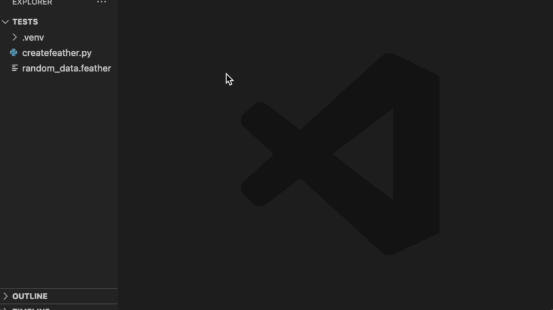

# Feather Preview

Feather Preview is a Visual Studio Code extension that allows you to preview Feather files directly in an editor tab. It provides a convenient way to view the contents of Feather files without leaving your code editor.

## Features

- Preview Feather files by right-clicking on a file with the `.feather` extension and selecting "Preview Feather File" from the context menu.
- The preview is displayed in a new editor tab, showing the contents of the Feather file in a paginated table format.
- Navigate through the pages of the Feather file using the "Previous" and "Next" buttons.
- The preview is updated dynamically as you navigate through the pages.

## Requirements

To use the Feather Preview extension, you need to have the following dependencies installed:

- Python: The extension uses a Python script to read and process Feather files. Make sure you have Python installed on your system.
- PyArrow: The Python script relies on the PyArrow library to read Feather files. You can install PyArrow by running `pip install pyarrow` in your terminal.
- Pandas: The Python script uses the Pandas library to convert the Feather data into an HTML table for preview. You can install Pandas by running `pip install pandas` in your terminal.

Please ensure that you have both PyArrow and Pandas installed in the Python environment used by the extension.

## Extension Settings

This extension does not contribute any additional settings to VS Code.

## Known Issues

- The extension assumes that Feather files are not compressed. If you encounter an error related to compression, please ensure that your Feather files are saved without compression.
- The extension uses a fixed number of rows per page (100) for pagination. If you have Feather files with a large number of rows, the preview might take some time to load.

## Release Notes

### 0.0.1

- Initial release of the Feather Preview extension.
- Supports previewing Feather files in an editor tab with pagination.

---

## Contributing

Contributions are welcome! If you encounter any issues or have suggestions for improvements, please open an issue or submit a pull request on the [GitHub repository](https://github.com/Strizzo/vscode-feather-preview).

## License

This extension is licensed under the [MIT License](LICENSE).